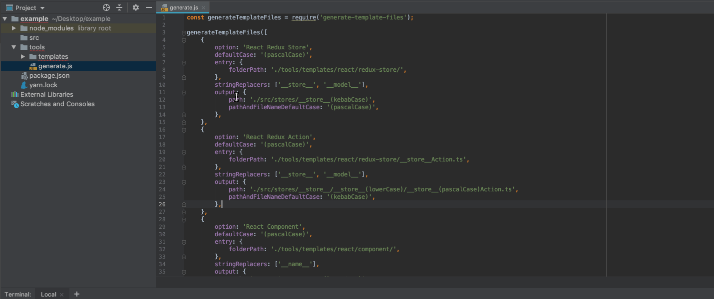

# `generate-template-files`

[![NPM version][npm-img]][npm-url] [![Downloads][downloads-img]][npm-url]

A simple generator that is independent from any language. Create custom boilerplate, scaffolding, skeleton, and templating code files that you need to create over and over again. All you need is [NodeJS](https://nodejs.org) installed to get started.

> Find this useful? Give it a :star:



Medium Article - [Generate Template Files with Ease](https://medium.com/@robertsavian/generate-template-files-with-ease-19b320615359)

## Install

With [NPM](http://npmjs.com):

```command
$ npm install generate-template-files
```

With [Yarn](https://yarnpkg.com):

```command
$ yarn add generate-template-files
```

## Usage

1. Check out the `examples` folder or create a file called `generate.js`. Note that this file name is flexible.
2. In that file, add in the example code below.
3. Run `node generate.js` within Terminal (Mac) or Powershell (Win) once you've added your template files.

```js
const {generateTemplateFiles} = require('generate-template-files');

const config = require('../package.json');

generateTemplateFiles([
    {
        option: 'Create Redux Store',
        defaultCase: '(pascalCase)',
        entry: {
            folderPath: './tools/templates/react/redux-store/',
        },
        stringReplacers: ['__store__', {question: 'Insert model name', slot: '__model__'}],
        output: {
            path: './src/stores/__store__(lowerCase)',
            pathAndFileNameDefaultCase: '(kebabCase)',
        },
    },
    {
        option: 'Create Reduce Action',
        defaultCase: '(pascalCase)',
        entry: {
            folderPath: './tools/templates/react/redux-store/__store__Action.ts',
        },
        stringReplacers: ['__store__', '__model__'],
        dynamicReplacers: [
            {slot: '__version__', slotValue: config.version},
            {slot: '__description__', slotValue: config.description},
        ],
        output: {
            path: './src/stores/__store__/__store__(lowerCase)/__store__(pascalCase)Action.ts',
            pathAndFileNameDefaultCase: '(kebabCase)',
        },
        onComplete: (results) => {
            console.log(`results`, results);
        },
    },
]);
```

As outlined in the `examples` folder, I prefer to create a `tools` folder and place `generate.js` w/ `templates` files in there. Additionally, I'll add a script task (`"generate": "node ./tools/generate.js"`) to my `package.json` file for convienent running of the generator using `npm run generate` or `yarn generate`.

```
┣━ package.json
┣━ src
┗━ tools/
   ┣━ generate.js
   ┗━ templates/
      ┣━ SomeFile.js
      ┗━ __name__(pascalCase)Action.ts
```

## API

The `generateTemplateFiles` function takes an array of `IConfigItem` items.

#### `IConfigItem`

-   `option` - The name of the option to choose when asked.
-   `defaultCase` - The default [Case Converters](#case-converters) to use with the [Replacer Slots](#replacer-slots-or-ireplacerslotquestion) in the template files. Default is `(noCase)`.
-   `entry.folderPath` - Path to a folder of files or a single template file.

-   `stringReplacers` - An array of [Replacer Slots](#replacer-slots-or-ireplacerslotquestion) used to replace content in the designated `entry.folderPath`.
-   `dynamicReplacers` - (Optional) An array of IReplacer used to replace content in the designated `entry.folderPath`.
-   `output.path` - The desired output path for generated files. [Case Converters](#case-converters) and [Replacer Slots](#replacer-slots-or-ireplacerslotquestion) can be used to make the path somewhat dynamic.
-   `output.pathAndFileNameDefaultCase` - The [Case Converters](#case-converters) to use for the file path and file name(s).
-   `onComplete` - (Optional) Takes a callback function that is called once the file(s) have been outputted. A [IResults](#iresults) object will be passed to the callback.

###### Example

```javascript
{
    option: 'Create Redux Store',
    defaultCase: '(pascalCase)',
    entry: {
        folderPath: './tools/templates/react/redux-store/',
    },
    stringReplacers: ['__store__', { question: 'Insert model name', slot: '__model__' }],
    dynamicReplacers: [
        {slot:'__version__', slotValue: config.version},
        {slot:'__description__', slotValue: config.description}
    ],
    output: {
        path: './src/stores/__store__(lowerCase)',
        pathAndFileNameDefaultCase: '(kebabCase)',
    },
    onComplete: (results) => {
        console.log(results);
    },
},
```

#### `IResults`

Below is an example of what you receive from the `onComplete` callback. It has the output path, list of files created and the [Replacer Slots](#replacer-slots-or-ireplacerslotquestion) with the value entered.

-   `output.path` - The file(s) output path
-   `output.files` - List of files created
-   `stringReplacers` - List of [Replacer Slots](#replacer-slots-or-ireplacerslotquestion); name and values entered during the setup process

###### Example data you would get from the onComplete callback

```javascript
{
    output: {
        path: './src/stores/some-thing',
        files: [
            './src/stores/some-thing/SomeThingModule.ts',
            './src/stores/some-thing/SomeThingModuleAction.ts',
            './src/stores/some-thing/SomeThingModuleGetter.ts',
            './src/stores/some-thing/SomeThingModuleMutation.ts',
            './src/stores/some-thing/SomeThingService.ts',
            './src/stores/some-thing/models/actions/ISomeThingState.ts',
            './src/stores/some-thing/models/actions/OtherThingResponseModel.ts'
        ]
    },
    stringReplacers: [
        {
            slot: '__store__',
            slotValue: 'some thing'
        },
        {
            slot: '__model__',
            slotValue: 'other thing'
        }
    ]
}
```

### Replacer Slots or IReplacerSlotQuestion

[Replacer Slots](#replacer-slots-or-ireplacerslotquestion) are unique string value(s) to be replaced by the generator. An array of string values and/or `IReplacerSlotQuestion` objects can be used.

```javascript
stringReplacers: ['__store__', {question: 'Insert model name', slot: '__model__'}];
```

Replacer slot can be any string value you want to use. You can use something like this in your template files and/or in the file path names.

-   `~replacerSlot~`
-   `{{something else}}`
-   `__AnythingYouWant__`

#### `IReplacerSlotQuestion`

Below is an example of a `IReplacerSlotQuestion`

```javascript
{question: 'Insert model name', slot: '__model__'}
```

-   `question` - The question to ask the use what value should be used for the replacer `slot`
-   `slot` - The string value for the [Replacer Slots](#replacer-slots-or-ireplacerslotquestion)

### Case Converters

[Case Converters](#case-converters) transform the string value entered upon use of the generator.

Example

-   In the generator template `__replacerSlot__` is appended by the `(pascalCase)` converter such as `__replacerSlot__(pascalCase)`.
-   When the generator is run, the string `"product reducer"` is provided for `__replacerSlot__`.
-   As a result, the converter will produce `ProductReducer`.

Here is the string `Lives down BY the River` with each of the converters:

    (noCase)        // Lives down BY the River
    (camelCase)     // livesDownByTheRiver
    (constantCase)  // LIVES_DOWN_BY_THE_RIVER
    (dotCase)       // lives.down.by.the.river
    (kebabCase)     // lives-down-by-the-river
    (lowerCase)     // livesdownbytheriver
    (pascalCase)    // LivesDownByTheRiver
    (pathCase)      // lives/down/by/the/river
    (sentenceCase)  // Lives down by the river
    (snakeCase)     // lives_down_by_the_river
    (titleCase)     // Lives Down By The River

One Rule: no spaces between the [Replacer Slots](#replacer-slots-or-ireplacerslotquestion) and [Case Converters](#case-converters). If there is a space, [Case Converters](#case-converters) will not work.

-   :white_check_mark: `__name__(camelCase)`
-   :warning: `__name__ (camelCase)`

[npm-url]: https://npmjs.org/package/generate-template-files
[downloads-img]: http://img.shields.io/npm/dm/generate-template-files.svg?style=flat-square
[npm-img]: http://img.shields.io/npm/v/generate-template-files.svg?style=flat-square
